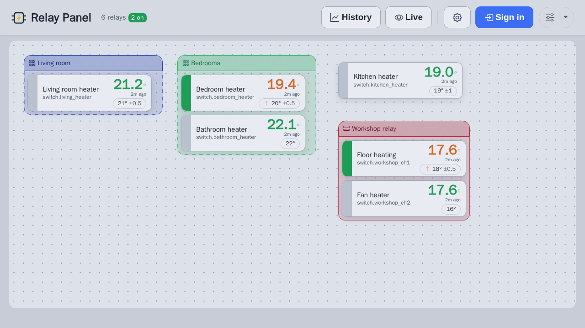

# HA Relay Panel


A visual web panel for **Home Assistant** that turns relays (switches) + temperature
sensors into simple thermostats. Drag relay widgets onto a canvas, bind each one to a
temperature sensor and a target temperature, and the panel generates a Home Assistant
automation that switches the relay to hold that temperature — with a clean, touch-friendly
UI for viewing and manual control.

Self-hosted, no cloud. Talks to your own Home Assistant over its REST/WebSocket API.



## Features

- **Visual editor** — place relay cards on a canvas; drag, group, and arrange them.
- **Thermostat binding** — pick a relay + a temperature sensor, choose heat/cool and a
  target °C; it creates/updates the matching HA automation (with a sensor-failure
  failsafe that turns the relay **off** if the sensor goes unavailable).
- **Areas & physical relays** — group cards into HA areas, and collapse a multi-channel
  relay (e.g. Shelly Pro) into one device box with its outputs.
- **Manual control** — toggle any relay on/off from its card, plus a per-area
  "All on / All off".
- **Maintenance mode** — pause a relay's automation without deleting it.
- **Health at a glance** — offline / missing-entity warnings per card, a header summary,
  and a Home-Assistant-unreachable banner.
- **24h history** — a temperature sparkline in the editor, with CSV export.
- **Activity log** — audit trail of who did what (login, bind, switch, rename, etc.),
  viewable from the Advanced menu; keeps the latest 1 000 events.
- **Light / dark themes** (follows the OS by default) and **English / Estonian** UI.
- **Sign-in with your Home Assistant account** — viewing is open; editing requires login,
  validated against HA (no passwords stored).
- **Layout stored in MariaDB** with automatic rolling backups, plus JSON import/export.

## Requirements

- Docker + Docker Compose
- A reachable Home Assistant instance and a **long-lived access token**
  (HA → profile → Security → Long-lived access tokens)
- (Optional) an MQTT broker — only needed to rename **Zigbee2MQTT** devices from the UI

## Quick start

```bash
git clone https://github.com/Gren-95/ha-relay-panel.git
cd ha-relay-panel
cp .env.example .env
# edit .env: set HA_URL + HA_TOKEN (and MQTT_URL if you use Zigbee2MQTT)

docker compose pull      # grab the prebuilt image (or omit to build locally)
docker compose up -d     # add --build to build from source instead
```

Open **http://<host>:8090**. Click **Edit**, sign in with your Home Assistant account,
then add a relay and bind it to a sensor.

## Docker image

Prebuilt multi-arch images (`linux/amd64`, `linux/arm64`) are published to the GitHub
Container Registry on every push:

```
ghcr.io/gren-95/ha-relay-panel:latest
```

The `compose.yml` above uses it by default (with a local `build:` fallback). The web
container is **stateless and runs unprivileged** — all data lives in the MariaDB service.
Tags: `latest`, the branch name, `sha-<commit>`, and `vX.Y.Z` on releases.

## Configuration (`.env`)

| Variable | What it is |
| --- | --- |
| `HA_URL` | Base URL of your Home Assistant (e.g. `http://homeassistant.local:8123`) |
| `HA_TOKEN` | A Home Assistant long-lived access token |
| `MQTT_URL` | MQTT broker URL (optional; for Zigbee2MQTT renames) |
| `DB_PASSWORD` / `DB_ROOT_PASSWORD` | Credentials for the bundled MariaDB container |

## How it works

- **Backend** — Node/Express (`server.js`) talks to Home Assistant via its REST +
  WebSocket API (`ha.js`) and, optionally, MQTT for Zigbee2MQTT (`z2m.js`). The panel
  layout is stored as JSON in MariaDB (`db.js`).
- **Frontend** — a single static page (`public/`), no build step.
- **Automations** — binding a relay writes a normal Home Assistant automation
  (`switch.turn_on/off` on a template condition), so it keeps working even if the panel
  is offline, and is visible/editable inside Home Assistant.

## Security note

The panel is designed for a trusted LAN. It holds a Home Assistant token server-side and
serves over plain HTTP by default — put it behind a reverse proxy with TLS if you expose
it beyond your local network. Editing requires signing in with a Home Assistant account
(no 2FA support in this simple login flow).

## License

[MIT](LICENSE)
