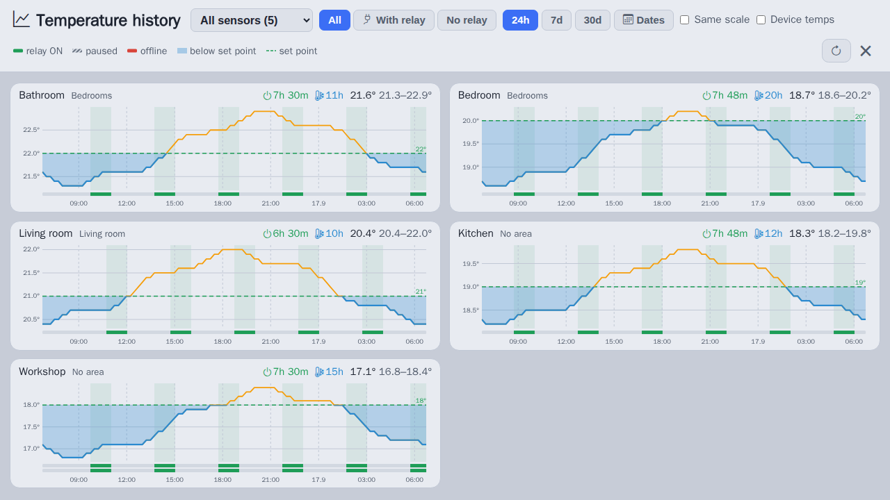
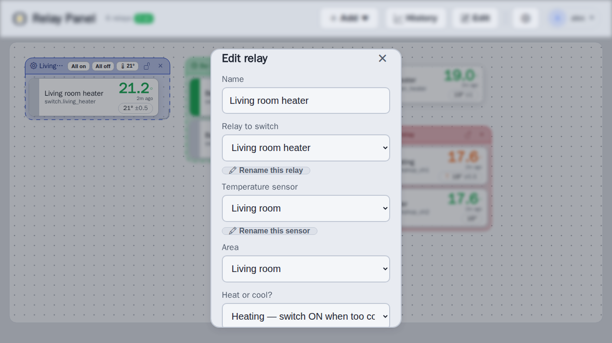
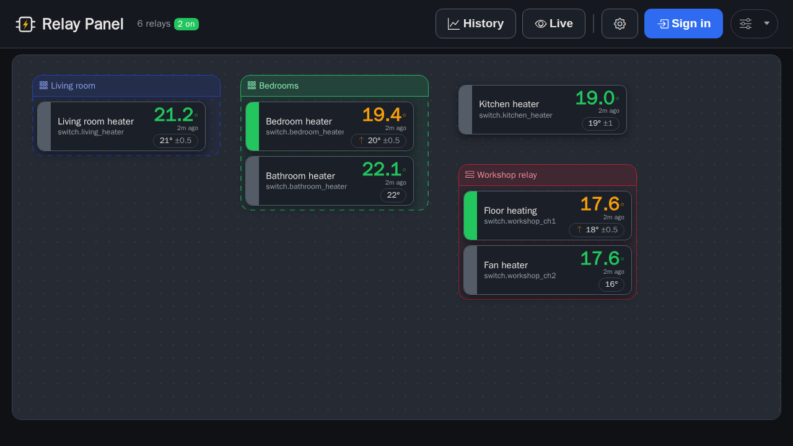
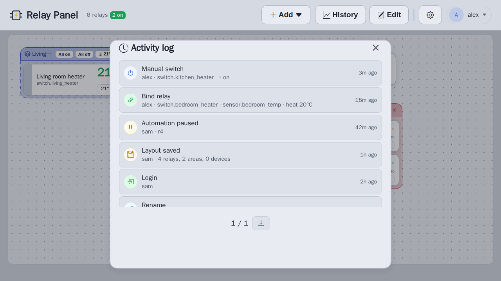

# HA Relay Panel


A visual web panel for **Home Assistant** that turns relays (switches) + temperature
sensors into simple thermostats. Place relay cards on a board, bind each one to a
temperature sensor and a set point, and the panel writes a Home Assistant automation
that switches the relay to hold that temperature - with a touch-friendly UI for watching
and controlling it.

Self-hosted, no cloud. Talks to your own Home Assistant over its REST/WebSocket API.


<table>
  <tr>
    <td width="50%"></td>
    <td width="50%"></td>
  </tr>
  <tr>
    <td align="center">Temperature history</td>
    <td align="center">Relay editor</td>
  </tr>
  <tr>
    <td width="50%"></td>
    <td width="50%"></td>
  </tr>
  <tr>
    <td align="center">Dark theme</td>
    <td align="center">Activity log</td>
  </tr>
</table>

## Features

### The board

- **Visual layout** - drag relay cards around a board, group them into Home Assistant
  **areas**, and collapse a multi-channel relay (e.g. a Shelly Pro) into one
  **physical relay** box holding its outputs. Boxes take a colour of your choosing.
- **Live state on every card** - current temperature and how old the reading is, the
  set point, and the relay's on/off state as the card's left edge (click it to switch).
- **Health at a glance** - offline / missing-entity warnings per card, a whole-box warning
  when a physical relay drops off the network, a header summary of how many relays are on,
  offline or paused, and a banner when Home Assistant itself is unreachable.
- **Edit and Live modes** - the board is read-only until you sign in and switch to Edit.
  **Lock** an area or relay so it cannot be dragged by accident.
- **Undo / redo** (Ctrl+Z, Ctrl+Shift+Z / Ctrl+Y) for layout changes, plus Ctrl+S to save
  and Ctrl+E to toggle Edit mode.
- **Zoom** the board from the account menu. Phones get a stacked, single-column layout ([screenshot](docs/mobile.png)).

### Thermostat control

- **Bind a relay to a sensor** - choose heating or auto mode and a target °C; the panel
  creates or updates the matching HA automation. A **sensor-failure failsafe** turns the
  relay **off** whenever the sensor is unavailable.
- **Switch-back gap** (hysteresis) and **minimum on / off times** to stop short cycling.
- **Schedules** - per-day time blocks with their own target temperature, and a fallback
  target for the rest of the time. Evaluated inside Home Assistant.
- **Set points in bulk** - per-area set point on the area's title bar, a global
  "Set temp for all" in the gear menu, and **Bulk edit** for mode / target / gap across
  all relays or one area, with a before/after preview.
- **Manual control** - toggle any relay from its card, **All on / All off** per area, and
  a global All off.
- **Maintenance mode** - pause a relay's automation without deleting it.
- **Duplicate** a configured relay, and **rename** relays and sensors in Home Assistant
  straight from the editor (Zigbee2MQTT devices are renamed over MQTT).

### History and alerts

- **History chart** per relay - click a card's temperature for 24h / 7d / 30d or a date
  range, with relay on/off and offline bands, and CSV export.
- **Temperature history page** - every sensor over one shared time window as small
  multiples: when each relay ran, sat paused or was offline, the set point as it changed,
  and time spent below it. Filter by area, sensor or whether a relay is attached.
- **Notifications** - a server-side watcher checks Home Assistant every 60 s and sends an
  alert through HA's `notify.*` service when a relay or sensor goes offline or a
  temperature drifts past a per-relay threshold (opt in per relay).
- **Activity log** - who did what (sign-ins, binds, switches, pauses, renames, layout
  saves, ...), from the gear menu, with CSV export; keeps the latest 1 000 events.

### Everything else

- **Sign in with your Home Assistant account** - viewing is open, every change requires a
  session validated against HA (no passwords stored). An optional
  [second sign-in provider](#second-sign-in-provider) can sit alongside it.
- **Layout stored in MariaDB** with the previous 30 versions kept as rolling backups,
  conflict detection when two people edit at once, and JSON import / export.
- **Light / dark themes** (follows the OS by default) and an **English / Estonian** UI.
- Optional **facility-map button** for combined temperature + humidity sensors
  ([below](#map-button)).

## Requirements

- Docker + Docker Compose
- A reachable Home Assistant instance and a **long-lived access token**
  (HA → profile → Security → Long-lived access tokens)
- (Optional) an MQTT broker - only needed to rename **Zigbee2MQTT** devices from the UI

## Quick start

```bash
git clone https://github.com/Gren-95/ha-relay-panel.git
cd ha-relay-panel
cp .env.example .env
# edit .env: set HA_URL + HA_TOKEN, and change DB_PASSWORD / DB_ROOT_PASSWORD

docker compose up -d --build
```

Open **http://&lt;host&gt;:8090** (or whatever `HTTP_PORT` you set). Click **Sign in** with
your Home Assistant account, switch to **Edit**, then add a relay and bind it to a sensor.

To update, `git pull` and run `docker compose up -d --build` again.

## Docker

`compose.yml` runs two containers: `relay-panel-web` (the app) and `relay-panel-db`
(MariaDB 12, data in the `relay-panel-data` volume). The web container is **stateless and
runs unprivileged** - everything that persists lives in the database.

The web image is **always built from your checkout** (`pull_policy: build`), so a stray
`docker compose pull` can never swap your running app for a different registry image. The
Tailwind stylesheet is compiled during the image build. To stamp the About dialog with a
version, pass the build args:

```bash
GIT_SHA=$(git rev-parse --short HEAD) BUILD_DATE=$(date -u +%F) docker compose up -d --build
```

## Configuration (`.env`)

`.env.example` lists every setting with an explanation.

| Variable | What it is |
| --- | --- |
| `HA_URL` | Base URL of your Home Assistant (e.g. `http://homeassistant.local:8123`) |
| `HA_TOKEN` | A Home Assistant long-lived access token |
| `DB_PASSWORD` / `DB_ROOT_PASSWORD` | Credentials for the bundled MariaDB container |
| `HTTP_PORT` | Host port the panel is published on (default `8090`) |
| `TZ` | Timezone for both containers - what the activity log and history charts render in (default `UTC`) |
| `MQTT_URL` | Optional MQTT broker URL, for renaming Zigbee2MQTT devices |
| `NOTIFY_SERVICE` | Optional HA notify service(s) for alerts, e.g. `notify.mobile_app_phone`; comma-separate several. Unset = no alerts |
| `KWS_MAP_URL` | Optional facility-map page for the [map button](#map-button). Unset = no button |
| `TRUST_PROXY` | Set to `1` only behind a reverse proxy, so `X-Forwarded-For` is trusted |
| `SECURE_COOKIE` | Set to `1` when serving over HTTPS, to add `Secure` to the session cookie |
| `EXTRA_AUTH_URL` | Optional [second sign-in provider](#second-sign-in-provider). Unset = Home Assistant accounts only |
| `EXTRA_AUTH_LABEL` | What to call that provider in the login dialog (default `Company account`) |
| `EXTRA_AUTH_PERM_URL` / `EXTRA_AUTH_PERM_TOKEN` / `EXTRA_AUTH_PERM_VALUE` | Optional permission check for that provider - all three or none |

`compose.yml` sets the database connection for you (`DB_HOST`, `DB_USER`, `DB_NAME`), and
the app listens on `PORT` (default `3000`) inside the container. You only need those when
running `node server.js` outside Compose, against a MariaDB of your own.

Every host, port and credential this app knows about is read from `.env`. Nothing in the
repository names a real deployment - if you need a concrete address in a comment, a test
fixture or an example, use a documentation-reserved one (`192.0.2.0/24`, RFC 5737).

### Second sign-in provider

Editing requires signing in, and by default that means a Home Assistant account. If your
site already has its own account service, set `EXTRA_AUTH_URL` to an endpoint that
accepts a form POST of `user` and `pass` and replies with the bare word `TRUE` when the
pair is valid. The login dialog then offers both, named by `EXTRA_AUTH_LABEL`.

Authenticating only proves who someone is. If your account service also knows who is
*allowed* to drive the panel, set `EXTRA_AUTH_PERM_URL` to an endpoint that answers the
question, plus `EXTRA_AUTH_PERM_TOKEN` (a shared secret) and `EXTRA_AUTH_PERM_VALUE`
(the permission to require). The panel POSTs `user`, `permission` and `token`, and
admits the account only on `{"allowed":true}`.

It asks a question rather than reading a permissions table directly, which is what keeps
this side small: no database credentials in this panel's `.env`, no route from the panel
to your account server's database, and nothing about your schema in this repository. The
token is what stops the endpoint being an open oracle for "does this person hold that
permission", which is why it travels in the body and not the query string.

It **fails closed** - unreachable, non-200, unparseable or anything but an explicit
`allowed:true` refuses, and the refusal is recorded in the activity log as a
`login.fail`. Home Assistant sign-ins skip the gate entirely, so an outage on the
permission service can never lock you out of your own panel.

It is off unless configured: with `EXTRA_AUTH_URL` unset no second option is rendered,
and the server rejects the choice even if a client asks for it. The provider is always
chosen explicitly rather than tried in turn, so a password is only ever sent to the one
service the operator picked, and the activity log records which one accepted or refused
it. `GET /api/config` tells the browser that the option exists and what to call it - the
endpoint itself stays in `.env`.

### Map button

A climate sensor that reports both temperature and humidity (`sensor.<base>_temperature`
+ `sensor.<base>_humidity`) is a *combo* sensor. Point `KWS_MAP_URL` at a floor-plan page
that plots those, and the history chart (click a card's temperature reading) and the
history page gain a 🗺 **Map** button opening `<KWS_MAP_URL>?sensor=HA%20<base>` in a new
tab - the map is expected to locate the marker carrying that identifier and highlight it.
Temperature-only sensors get no button, and with `KWS_MAP_URL` unset the feature
disappears entirely.

## How it works

- **Backend** - Node 24 / Express 5 (`server.js`, `routes/`, `lib/`) talks to Home
  Assistant via its REST + WebSocket API (`ha.js`) and, optionally, MQTT for Zigbee2MQTT
  (`z2m.js`). The layout, sessions and activity log live in MariaDB (`db.js`).
- **Frontend** - a single static page (`public/`): vanilla JS modules in `public/js/`
  and Tailwind CSS compiled from `src/input.css` (`npm run build:css`).
- **Automations** - binding a relay writes a normal Home Assistant automation. It
  re-evaluates whenever the sensor changes and every 5 minutes, with the schedule, gap and
  minimum on/off times built into its conditions. It keeps working when the panel is
  offline, and is visible and editable inside Home Assistant.

## Testing

The suites run in containers, so the host needs only Docker:

```bash
./scripts/test.sh          # unit + lint + e2e
./scripts/test.sh unit     # Node's built-in test runner (tests/unit/)
./scripts/test.sh lint     # ESLint, plus a check for Tailwind classes it cannot see
./scripts/test.sh e2e      # Playwright (tests/e2e/) - extra args go to playwright
```

The e2e suite runs against a **running panel** (`BASE_URL`, default
`http://localhost:8090`), so deploy first. Every Home Assistant- and database-backed
endpoint is mocked in the browser, so a run touches neither.

With Node 24 on the host you can also use `npm run test:unit`, `npm run lint` and
`npm run test:e2e` directly.

### Screenshots

The images above are generated from seeded demo data by `scripts/screenshots.mjs`, with
the API mocked the same way as the e2e tests. With the panel running:

```bash
npm run screenshots        # writes docs/*.png
```

or without Node on the host:

```bash
docker run --rm --network host -v "$PWD":/app -w /app \
  mcr.microsoft.com/playwright:v<version>-noble \
  sh -c 'npm ci && node scripts/screenshots.mjs'
```

where `<version>` is the `@playwright/test` version in `package-lock.json`.

## Security note

The panel is designed for a trusted LAN. It holds a Home Assistant token server-side and
serves plain HTTP by default. If you expose it beyond your local network, put it behind a
reverse proxy with TLS (Caddy, nginx, ...) and set:

- `SECURE_COOKIE=1` - the session cookie is then only ever sent over HTTPS.
- `TRUST_PROXY=1` - so the login rate limiter sees the real client address rather than
  the proxy's. Leave it off when the panel is **not** behind a proxy, or clients could spoof
  `X-Forwarded-For` to dodge the rate limit.

Viewing is open to anyone who can reach the page; every change requires a signed-in
session. There is no 2FA in this login flow.

## License

[MIT](LICENSE)
